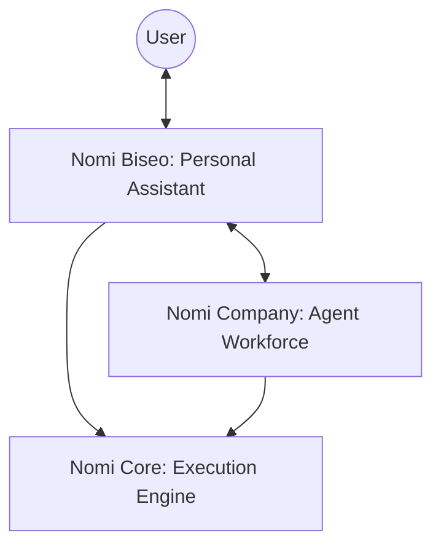

# 🌌 Nomi AI System

> **Personal AI Ecosystem:** An intelligent assistant that knows you deeply and coordinates a specialized workforce to get things done.

Nomi is built around one core idea: **AI should know you, remember you, and work for you.** It combines a personal "Chief of Staff" with a specialized workforce, all powered by a robust execution engine.

---

## 🏗️ System Architecture

Nomi operates in three distinct layers, ensuring a seamless user experience backed by powerful automation.

| Layer | Component | Description |
| --- | --- | --- |
| **Top** | **Nomi Company** | The **Workforce**. Specialized agents executing tasks. |
| **Middle** | **Nomi Biseo** | The **Chief of Staff**. Your single point of contact. |
| **Bottom** | **Nomi Core** | The **Engine**. Infrastructure, LLM abstraction, and validation. |

---

## 🧩 Core Components

### 🧠 Nomi Biseo (Personal Assistant)

Biseo is the heart of the system. Unlike generic bots, Biseo maintains a **persistent relationship** with you.

* **Deep Memory:** Becomes more valuable the longer you use it.
* **Proactive:** Surfaces insights, manages emails, and summarizes news.
* **Orchestrator:** Delegates complex tasks to the Agent Workforce.

### 💼 Nomi Company (Agent Workforce)

A collection of specialized, stateless agents. They don't talk to you; they work for Biseo.

* **Research Agent:** Web research & fact summarization.
* **News Agent:** Trend detection & daily briefings.
* **Email/Data Agents:** Managing communications and processing patterns.
* **Writer/Coding Agents:** Content generation and technical implementation.

### ⚙️ Nomi Core (Execution Engine)

The invisible infrastructure layer that powers the entire ecosystem.

* **LLM Abstraction:** Handles communication with various AI models.
* **Safety & Logic:** Manages retry logic, structured output validation, and cost tracking.

---

## 💾 Memory Model

Biseo’s personalization is powered by a four-layer memory structure:

1. **👤 Profile:** Static info (Name, timezone, occupation).
2. **🎯 Goals:** Your short and long-term objectives.
3. **🔄 Habits:** Recurring patterns (e.g., "8 AM news briefing").
4. **📜 History:** Context from past conversations for continuity.

---

## 🛠️ Tooling & Capabilities

Agents execute tasks using a **capability-based model**: `Goal ➔ Capability ➔ Agent`.

| Tool | Function |
| --- | --- |
| 🌐 **Web Search** | Real-time information retrieval. |
| 📧 **Email API** | Reading, drafting, and classifying mail. |
| 📅 **Calendar** | Scheduling and reminder management. |
| 📊 **Database** | Persistent data storage and querying. |
| 📁 **File Pro** | Parsing and generating documents. |

---

## 🚀 Workflow Execution

When you give a command, Biseo classifies it into one of three categories:

* **💬 Chat:** Standard conversation using memory.
* **⚡ Simple Task:** Direct tool use or single agent invocation.
* **📝 Workflow:** A multi-step plan involving the workforce.

### The 6-Step Planning Model:

1. **Understand:** Clarify the goal using memory context.
2. **Decompose:** Break the goal into subtasks.
3. **Assign:** Match subtasks to agents by capability.
4. **Execute:** Delegate via Nomi Core.
5. **Aggregate:** Collect and verify structured results.
6. **Deliver:** Synthesize a single, coherent response.

---

## 🛡️ Design Principles

* **One Relationship:** You only ever talk to Biseo.
* **Memory-First:** Personalization is the core, not an add-on.
* **Resilient:** Built-in failure handling and fallback strategies.
* **Provider Independent:** LLM-agnostic architecture.

---

## 👥 System Roles

* **Biseo:** Your Chief of Staff. Protective of your time, deep in your context.
* **Agents:** Specialized workers. Focused, concise, and structured.
* **Developer Assistant:** Ready to help build, architect, and scale the Nomi ecosystem.

---
